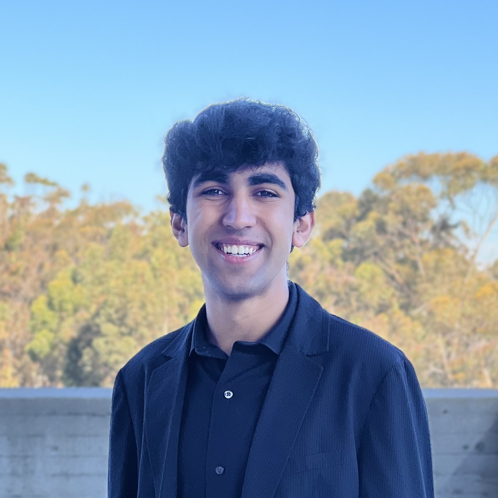
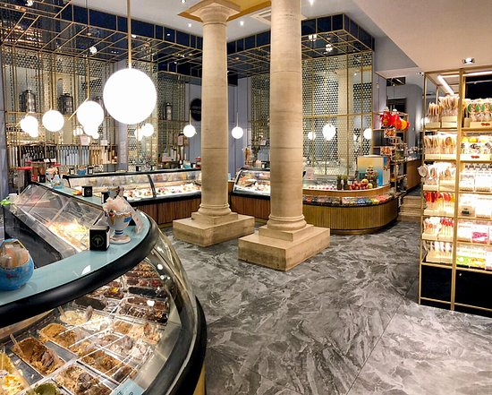

# Harsh Gurnani

## About me

Hi! My name is Harsh Gurnani, and I am a second year computer science major at UCSD. I am a software developer greatly interested in machine learning and its application. In particular, I am excited by healthcare technology, a field with the potential for much innovation and real-world impact. To this end, my most used line of code is likely:

```
import pandas as pd
```

Outside of programming and school, I **_love_** to travel. My favorite destination so far has been Rome - I really enjoy learning about the history of places, and Rome has a lot to offer in that sense (and the food was great).



> The best part of Rome was the gelato - this store had 150 different flavors!

Some of my other top recommendations, in order, are:

1. Barcelona, Spain
2. San Diego, CA, USA
3. Dubai, UAE

## Contact Me

To contact me, you can connect with me at my [Linkedin](https://linkedin.com/in/harshgurnani). My profile should look like [this](Linkedin-Profile.png). Other forms of contact are:

- Email: gurnani.harsh@gmail.com
- Phone: (925)-789-8897
- Physical mail: 9500 Gilman Drive, La Jolla, CA, 92093

## Todo list

If you've gotten this far in my page, take a few minutes every morning to check off these items for a good start to the day.

- [ ] Brush your teeth
- [ ] Make your bed
- [ ] Take a shower + skincare routine
